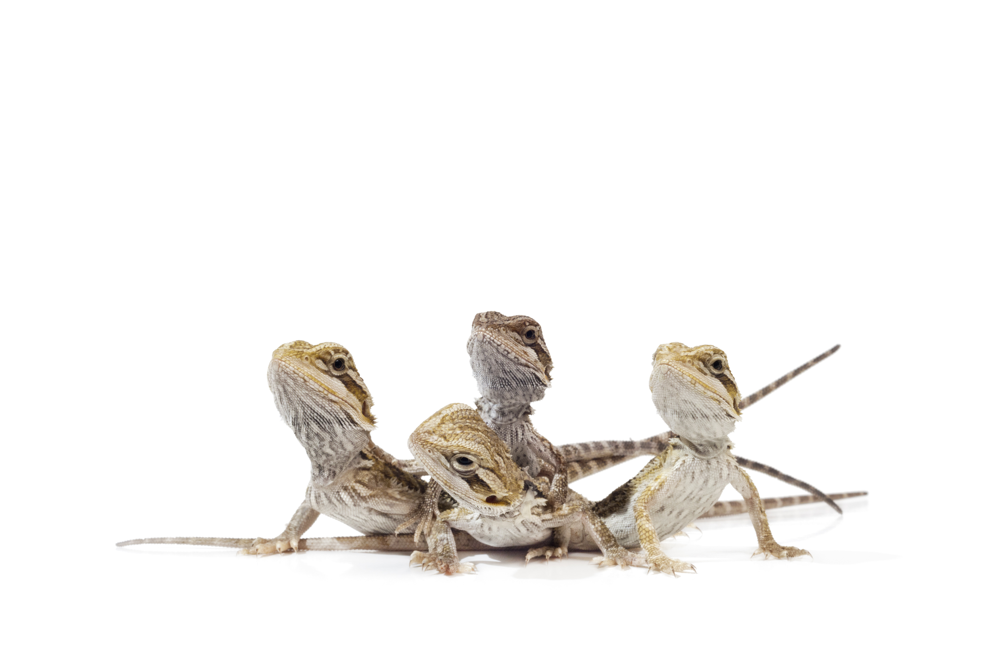

```{r setup, include = FALSE}

knitr::opts_chunk$set(dpi = 300,
                      echo = FALSE,
                      warning = FALSE,
                      error = FALSE,
                      fig.align = 'center')

```

```{r}


library(tinytex)
library(rmarkdown)
library(knitr)

```

***

## Outline

- Chapter 1: Free Software should be the way to go

- Chapter 2: Free Software should be the way to go

- Chapter 3: Free Software should be the way to go

- Chapter 4: Free Software should be the way to go


***


# Chapter 1


***


## What is Life History Theory?

\begincols
  \begincol{.48\textwidth}

\justifying

{#id .class width=60% height=80%}
{#id .class width=70% height=70%}
<br><br>
  \endcol
\begincol{.48\textwidth}

\justifying

{#id .class width=80% height=70%}


  \endcol
\endcols
